# Git Worktrees + Tmux Windows 自动化管理系统

**开发计划文档 v1.2**

> 在 Neovim 中创建 git worktree 时，自动在固定的 tmux session 中创建对应的 window，实现统一管理。

---

## 📋 目录

- [依赖库](#依赖库)
- [项目概述](#项目概述)
- [需求规格说明](#需求规格说明)
- [技术架构设计](#技术架构设计)
- [详细设计](#详细设计)
- [日志调试系统](#日志调试系统)
- [核心算法](#核心算法)
- [配置规格](#配置规格)
- [测试计划](#测试计划)
- [开发步骤](#开发步骤)
- [风险与挑战](#风险与挑战)

---

## 📦 依赖库

### 必选依赖

| 库 | 用途 | 说明 |
|---|---|---|
| **plenary.nvim** | 异步执行、路径处理、测试 | git/rsync 异步执行，不阻塞 UI |
| **nui.nvim** | UI 组件 | 输入框、确认对话框、进度展示 |

### 可选依赖

| 库 | 用途 | 说明 |
|---|---|---|
| **fzf-lua** | Worktree 跳转选择器 | 模糊搜索快速跳转 |
| **snacks.nvim** | 通知系统 | 更好的通知动画和进度展示 |

### 依赖关系图

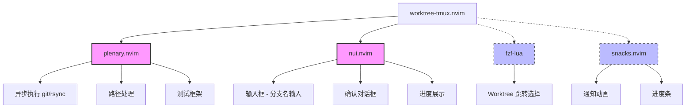

---

## 📖 项目概述

### 目标

创建一个 Neovim 插件，实现 git worktree 与 tmux window 的自动化管理，提升多分支并行开发效率。

### 核心价值

- ✅ **一键创建**：创建 worktree 时自动创建对应 tmux window
- ✅ **统一管理**：所有 worktrees 集中在固定的 `worktrees` session
- ✅ **快速切换**：通过 fzf-lua 模糊搜索快速跳转
- ✅ **完整同步**：自动同步所有文件（包括 .gitignore 内容）
- ✅ **自动清理**：删除 worktree 时自动删除 tmux window

### 使用场景

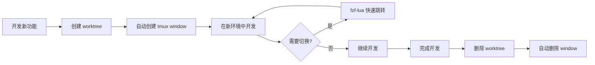

---

## 🎯 需求规格说明

### 功能需求总览


### FR-1: 创建 Worktree + Tmux Window

#### 功能描述

创建新的 git worktree，同时在 `worktrees` session 创建对应的 tmux window。

#### 输入输出

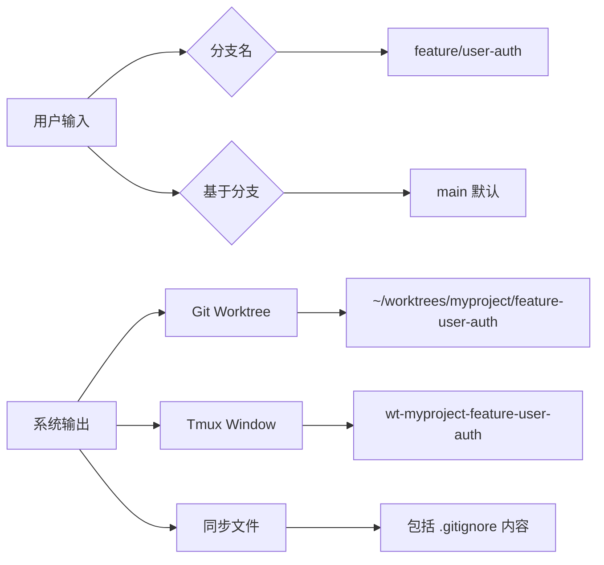

#### 执行流程

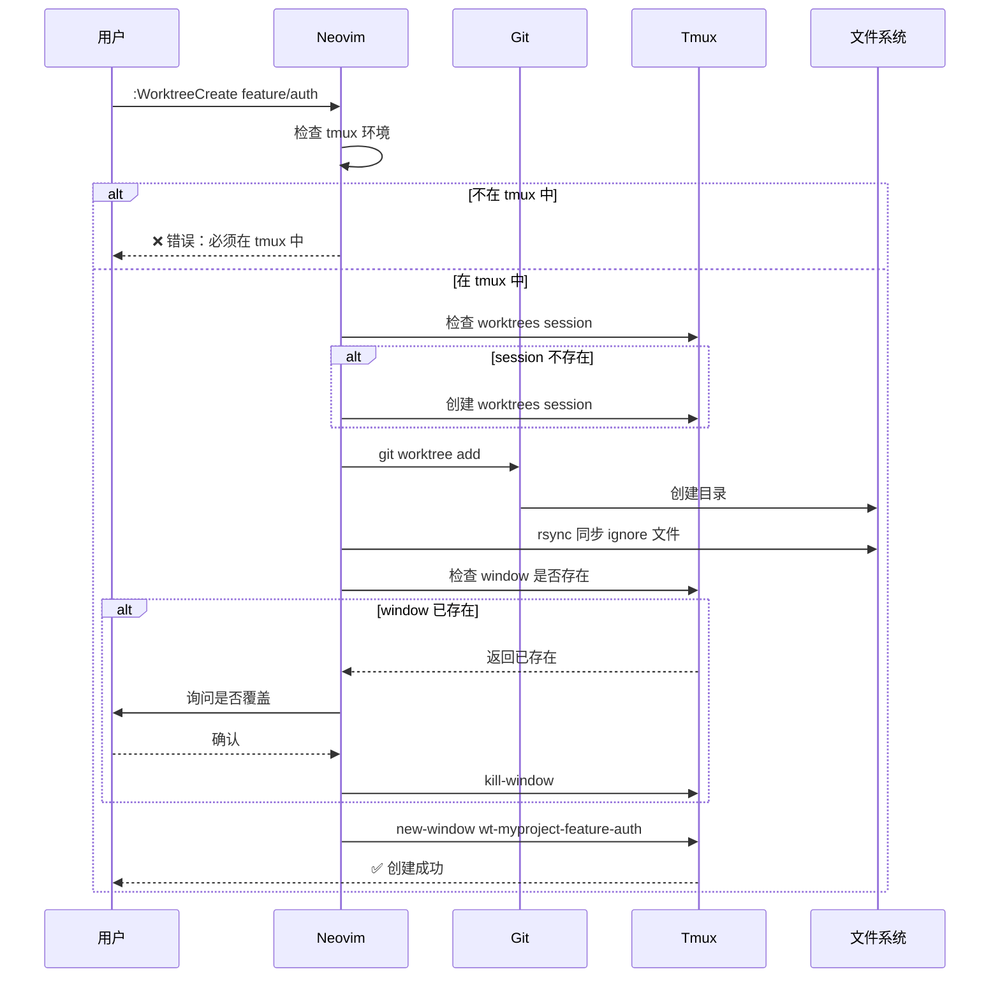

#### 前置条件

- **环境检查**：
  - ✅ 在 tmux 环境中（`$TMUX` 环境变量存在）
  - ✅ 在 git 仓库中（存在 `.git` 目录）
  - ✅ 分支名有效（符合 git 命名规则）

#### 后置条件

- **文件系统**：
  - ✅ Worktree 目录已创建
  - ✅ 所有文件已同步（包括 ignore 内容）
- **Tmux 状态**：
  - ✅ `worktrees` session 存在
  - ✅ 新 window 已创建并命名正确
  - ✅ Window 工作目录为 worktree 路径

#### 边界情况

| 情况                | 处理方式                  |
| ------------------- | ------------------------- |
| 不在 tmux 中        | ❌ 显示错误，拒绝创建     |
| 不在 git 仓库       | ❌ 显示错误，拒绝创建     |
| Window 名已存在     | 询问用户是否覆盖          |
| Worktree 目录已存在 | Git 报错，插件捕获并提示  |
| 磁盘空间不足        | rsync 失败，回滚 worktree |

---

### FR-2: 切换 Worktree 环境

#### 功能描述

通过 fzf-lua 模糊搜索并切换到指定 worktree 的 tmux window。

#### 执行流程

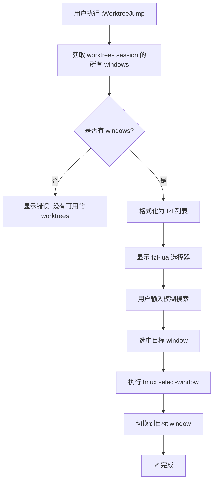

#### UI 设计

```
┌─ Worktree Jump ─────────────────────────────────────────┐
│ > fea█                                                   │
├──────────────────────────────────────────────────────────┤
│ > wt-myproject-feature-user-auth    (active)            │
│   wt-myproject-feature-payment                          │
│   wt-myproject-bugfix-login                             │
│   wt-myproject-experiment-ml                            │
│                                                          │
│ 4/4                                                      │
└──────────────────────────────────────────────────────────┘
```

---

### FR-3: 删除 Worktree + Window

#### 功能描述

删除 git worktree 时自动删除对应的 tmux window。

#### 执行流程

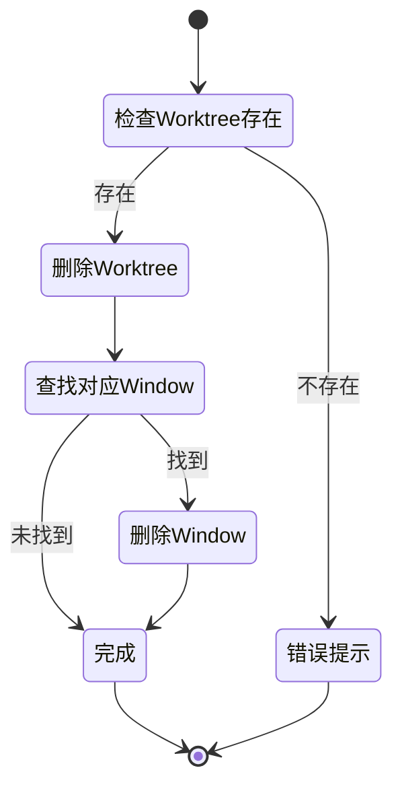

---

### FR-4: 同步 Worktrees → Windows

#### 功能描述

如果 worktree 存在但对应 window 不存在，自动创建缺失的 window。

#### 触发时机

- **自动触发**：Neovim 启动时检测
- **手动触发**：执行 `:WorktreeSync` 命令

#### 同步逻辑

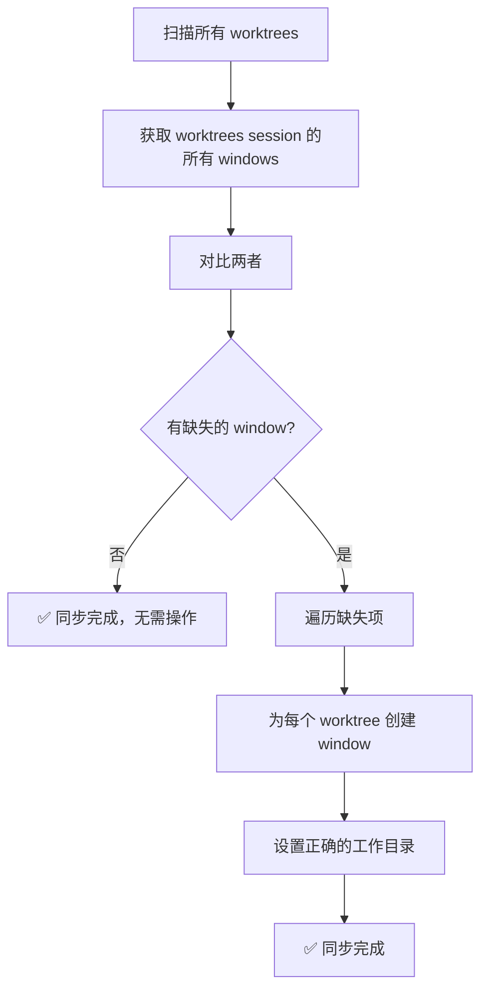

---

## 🏗️ 技术架构设计

### 系统架构图

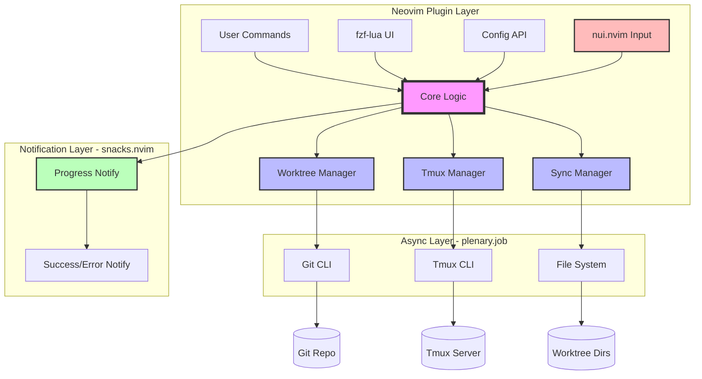

### 模块分层设计

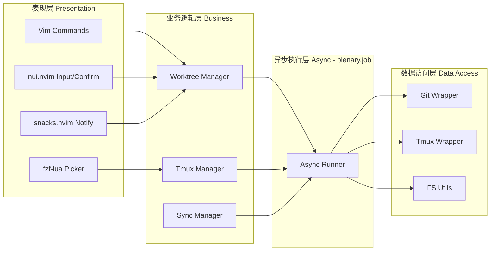

### 数据流图

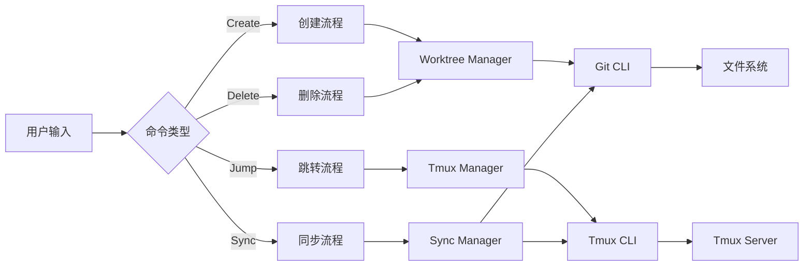

---

## 📐 详细设计

### 目录结构

> 采用 base.nvim 模版结构，增加完整的日志调试系统

```
worktree-tmux.nvim/
├── plugin/                          # 插件入口层（延迟加载）
│   └── worktree-tmux.lua            # Vim 命令定义，首次执行才加载核心
│
├── lua/worktree-tmux/               # 核心模块层
│   ├── init.lua                     # 主模块入口，导出 setup() 和 API
│   ├── config.lua                   # 配置管理（深度合并、验证）
│   ├── types.lua                    # LuaCATS 类型定义
│   ├── health.lua                   # 健康检查模块 (:checkhealth)
│   │
│   ├── log/                         # 📊 日志调试系统（三层架构）
│   │   ├── init.lua                 # 日志模块入口
│   │   ├── vlog.lua                 # 第一层：核心日志引擎
│   │   ├── logger.lua               # 第二层：插件包装器
│   │   ├── debug.lua                # 第三层：高级调试工具
│   │   └── file_logger.lua          # 文件日志器 (debug_log.txt)
│   │
│   ├── core.lua                     # 核心业务逻辑
│   ├── tmux.lua                     # Tmux 操作封装
│   ├── git.lua                      # Git 操作封装
│   ├── sync.lua                     # 文件同步
│   ├── async.lua                    # 异步执行封装 (plenary.job)
│   │
│   ├── ui/                          # UI 组件层
│   │   ├── init.lua                 # UI 模块入口
│   │   ├── input.lua                # nui.nvim 输入框
│   │   ├── confirm.lua              # nui.nvim 确认对话框
│   │   ├── picker.lua               # fzf-lua 选择器
│   │   └── progress.lua             # 进度展示
│   │
│   ├── notify.lua                   # 通知封装 (snacks.nvim fallback)
│   └── utils.lua                    # 工具函数
│
├── spec/                            # 测试层 (busted + nlua)
│   ├── worktree-tmux/
│   │   ├── core_spec.lua
│   │   ├── tmux_spec.lua
│   │   ├── git_spec.lua
│   │   ├── async_spec.lua
│   │   └── log_spec.lua
│   └── minimal_init.lua             # 最小化测试环境
│
├── doc/
│   └── worktree-tmux.txt            # vimdoc 帮助文档
│
├── docs/                            # Markdown 文档
│   ├── architecture.md              # 架构文档
│   └── usage-zh.md                  # 中文使用文档
│
├── .github/workflows/               # CI/CD
│   └── test.yml                     # 测试工作流
│
├── .busted                          # Busted 测试配置
├── worktree-tmux.nvim-scm-1.rockspec # LuaRocks 配置
├── CLAUDE.md                        # 开发指南
├── README.md
└── LICENSE
```

### 模块设计

#### 1. Core Module (`core.lua`)

**职责**：核心业务逻辑编排

```lua
local M = {}

--- 创建 worktree + tmux window
-- @param branch string 分支名（完整路径，如 feature/user-auth）
-- @param base string 基于哪个分支（默认当前分支）
-- @return boolean 是否成功
M.create_worktree_window = function(branch, base)
    -- 实现见算法部分
end

--- 删除 worktree + tmux window
-- @param worktree_path string worktree 路径
-- @return boolean 是否成功
M.delete_worktree_window = function(worktree_path)
    -- 实现
end

--- 同步 worktrees → tmux windows
-- @return table { created: number, skipped: number }
M.sync_worktrees = function()
    -- 实现
end

return M
```

#### 2. Tmux Module (`tmux.lua`)

**职责**：封装所有 tmux 操作

```lua
local M = {}

--- 检查是否在 tmux 中
-- @return boolean
M.in_tmux = function()
    return vim.env.TMUX ~= nil
end

--- 检查 session 是否存在
-- @param name string session 名称
-- @return boolean
M.session_exists = function(name)
    local cmd = string.format("tmux has-session -t %s 2>/dev/null", name)
    vim.fn.system(cmd)
    return vim.v.shell_error == 0
end

--- 创建 session
-- @param name string session 名称
-- @return boolean
M.create_session = function(name)
    local cmd = string.format("tmux new-session -d -s %s", name)
    vim.fn.system(cmd)
    return vim.v.shell_error == 0
end

--- 检查 window 是否存在
-- @param session string session 名称
-- @param window string window 名称
-- @return boolean
M.window_exists = function(session, window)
    local cmd = string.format(
        "tmux list-windows -t %s -F '#{window_name}' 2>/dev/null | grep -x '%s'",
        session, window
    )
    vim.fn.system(cmd)
    return vim.v.shell_error == 0
end

--- 创建 window
-- @param opts table { session, name, cwd, cmd }
-- @return boolean
M.create_window = function(opts)
    local cmd_parts = {
        "tmux new-window",
        string.format("-t %s", opts.session),
        string.format("-n '%s'", opts.name),
        string.format("-c '%s'", opts.cwd),
    }

    if opts.cmd then
        table.insert(cmd_parts, string.format("'%s'", opts.cmd))
    end

    local cmd = table.concat(cmd_parts, " ")
    vim.fn.system(cmd)
    return vim.v.shell_error == 0
end

--- 删除 window
-- @param session string
-- @param window string
-- @return boolean
M.delete_window = function(session, window)
    local cmd = string.format("tmux kill-window -t %s:%s", session, window)
    vim.fn.system(cmd)
    return vim.v.shell_error == 0
end

--- 列出所有 windows
-- @param session string
-- @return table 列表 { { name, index, active } }
M.list_windows = function(session)
    local cmd = string.format(
        "tmux list-windows -t %s -F '#{window_index}:#{window_name}:#{window_active}'",
        session
    )
    local output = vim.fn.system(cmd)

    if vim.v.shell_error ~= 0 then
        return {}
    end

    local windows = {}
    for line in output:gmatch("[^\r\n]+") do
        local index, name, active = line:match("(%d+):([^:]+):(%d)")
        table.insert(windows, {
            index = tonumber(index),
            name = name,
            active = active == "1",
        })
    end

    return windows
end

--- 切换到指定 window
-- @param session string
-- @param window string
-- @return boolean
M.select_window = function(session, window)
    local cmd = string.format("tmux select-window -t %s:%s", session, window)
    vim.fn.system(cmd)
    return vim.v.shell_error == 0
end

return M
```

#### 3. Git Module (`git.lua`)

**职责**：Git worktree 操作

```lua
local M = {}

--- 获取 git 仓库名
-- @return string|nil
M.get_repo_name = function()
    local cmd = "git rev-parse --show-toplevel 2>/dev/null"
    local output = vim.fn.system(cmd):gsub("%s+$", "")

    if vim.v.shell_error ~= 0 then
        return nil
    end

    return vim.fn.fnamemodify(output, ":t")
end

--- 获取所有 worktrees
-- @return table { { path, branch, bare } }
M.get_worktree_list = function()
    local cmd = "git worktree list --porcelain"
    local output = vim.fn.system(cmd)

    if vim.v.shell_error ~= 0 then
        return {}
    end

    local worktrees = {}
    local current = {}

    for line in output:gmatch("[^\r\n]+") do
        if line:match("^worktree ") then
            current.path = line:match("^worktree (.+)$")
        elseif line:match("^branch ") then
            current.branch = line:match("^branch refs/heads/(.+)$")
        elseif line:match("^bare") then
            current.bare = true
        elseif line == "" and current.path then
            table.insert(worktrees, current)
            current = {}
        end
    end

    if current.path then
        table.insert(worktrees, current)
    end

    return worktrees
end

--- 创建 worktree
-- @param path string 目标路径
-- @param branch string 分支名
-- @param base string 基于分支
-- @return boolean
M.create_worktree = function(path, branch, base)
    local cmd
    if base then
        cmd = string.format("git worktree add %s -b %s %s", path, branch, base)
    else
        cmd = string.format("git worktree add %s %s", path, branch)
    end

    vim.fn.system(cmd)
    return vim.v.shell_error == 0
end

--- 删除 worktree
-- @param path string
-- @return boolean
M.delete_worktree = function(path)
    local cmd = string.format("git worktree remove %s", path)
    vim.fn.system(cmd)
    return vim.v.shell_error == 0
end

return M
```

#### 4. Sync Module (`sync.lua`)

**职责**：同步 .gitignore 文件

```lua
local M = {}

--- 同步 ignored 文件到新 worktree
-- @param source string 源目录（当前仓库）
-- @param target string 目标目录（新 worktree）
-- @return boolean
M.sync_ignored_files = function(source, target)
    -- 1. 读取 .gitignore
    local gitignore_path = source .. "/.gitignore"
    if vim.fn.filereadable(gitignore_path) == 0 then
        return true -- 没有 .gitignore，跳过
    end

    local ignore_patterns = {}
    for line in io.lines(gitignore_path) do
        -- 忽略空行和注释
        if line ~= "" and not line:match("^#") then
            table.insert(ignore_patterns, line)
        end
    end

    -- 2. 为每个 pattern 执行 rsync
    for _, pattern in ipairs(ignore_patterns) do
        local source_path = source .. "/" .. pattern
        local target_path = target .. "/" .. pattern

        -- 检查源是否存在
        if vim.fn.isdirectory(source_path) == 1 or vim.fn.filereadable(source_path) == 1 then
            -- 使用 rsync 复制（保持权限）
            local cmd = string.format(
                "rsync -a --exclude='.git' '%s' '%s'",
                source_path,
                target_path
            )
            vim.fn.system(cmd)

            if vim.v.shell_error ~= 0 then
                vim.notify(
                    string.format("⚠️  同步失败: %s", pattern),
                    vim.log.levels.WARN
                )
            end
        end
    end

    return true
end

return M
```

#### 5. Async Module (`async.lua`)

**职责**：异步执行封装 (plenary.job)

```lua
local M = {}
local Job = require("plenary.job")

--- 异步执行命令
-- @param opts table { cmd, args, on_success, on_error, on_progress }
-- @return Job
M.run = function(opts)
    local notify = require("worktree-tmux.notify")

    local job = Job:new({
        command = opts.cmd,
        args = opts.args or {},
        cwd = opts.cwd,
        on_stdout = function(_, data)
            if opts.on_progress then
                opts.on_progress(data)
            end
        end,
        on_stderr = function(_, data)
            if opts.on_progress then
                opts.on_progress(data)
            end
        end,
        on_exit = function(j, return_val)
            vim.schedule(function()
                if return_val == 0 then
                    if opts.on_success then
                        opts.on_success(j:result())
                    end
                else
                    if opts.on_error then
                        opts.on_error(j:stderr_result(), return_val)
                    else
                        notify.error("命令执行失败: " .. opts.cmd)
                    end
                end
            end)
        end,
    })

    job:start()
    return job
end

--- 异步执行 git 命令
-- @param args table git 命令参数
-- @param callbacks table { on_success, on_error }
M.git = function(args, callbacks)
    return M.run({
        cmd = "git",
        args = args,
        on_success = callbacks.on_success,
        on_error = callbacks.on_error,
    })
end

--- 异步执行 tmux 命令
-- @param args table tmux 命令参数
-- @param callbacks table { on_success, on_error }
M.tmux = function(args, callbacks)
    return M.run({
        cmd = "tmux",
        args = args,
        on_success = callbacks.on_success,
        on_error = callbacks.on_error,
    })
end

--- 异步执行 rsync 命令
-- @param source string
-- @param target string
-- @param callbacks table { on_success, on_error, on_progress }
M.rsync = function(source, target, callbacks)
    return M.run({
        cmd = "rsync",
        args = { "-a", "--exclude=.git", "--progress", source, target },
        on_success = callbacks.on_success,
        on_error = callbacks.on_error,
        on_progress = callbacks.on_progress,
    })
end

return M
```

#### 6. UI Input Module (`ui/input.lua`)

**职责**：nui.nvim 输入框

```lua
local M = {}
local Input = require("nui.input")
local event = require("nui.utils.autocmd").event

--- 显示分支名输入框
-- @param opts table { prompt, default, on_submit, on_close }
M.branch_input = function(opts)
    local input = Input({
        position = "50%",
        size = {
            width = 60,
        },
        border = {
            style = "rounded",
            text = {
                top = opts.prompt or " 输入分支名 ",
                top_align = "center",
            },
        },
        win_options = {
            winhighlight = "Normal:Normal,FloatBorder:FloatBorder",
        },
    }, {
        prompt = "  ",
        default_value = opts.default or "",
        on_submit = function(value)
            if value and value ~= "" then
                if opts.on_submit then
                    opts.on_submit(value)
                end
            end
        end,
        on_close = function()
            if opts.on_close then
                opts.on_close()
            end
        end,
    })

    -- 挂载并设置快捷键
    input:mount()

    -- ESC 关闭
    input:map("n", "<Esc>", function()
        input:unmount()
    end, { noremap = true })

    -- 自动关闭
    input:on(event.BufLeave, function()
        input:unmount()
    end)
end

return M
```

#### 7. UI Confirm Module (`ui/confirm.lua`)

**职责**：nui.nvim 确认对话框

```lua
local M = {}
local Menu = require("nui.menu")
local event = require("nui.utils.autocmd").event

--- 显示确认对话框
-- @param opts table { title, message, on_yes, on_no }
M.show = function(opts)
    local menu = Menu({
        position = "50%",
        size = {
            width = 40,
            height = 4,
        },
        border = {
            style = "rounded",
            text = {
                top = opts.title or " 确认 ",
                top_align = "center",
            },
        },
        win_options = {
            winhighlight = "Normal:Normal,FloatBorder:FloatBorder",
        },
    }, {
        lines = {
            Menu.item("  是 (Yes)", { action = "yes" }),
            Menu.item("  否 (No)", { action = "no" }),
        },
        max_width = 40,
        keymap = {
            focus_next = { "j", "<Down>", "<Tab>" },
            focus_prev = { "k", "<Up>", "<S-Tab>" },
            close = { "<Esc>", "q" },
            submit = { "<CR>", "<Space>" },
        },
        on_submit = function(item)
            if item.action == "yes" then
                if opts.on_yes then
                    opts.on_yes()
                end
            else
                if opts.on_no then
                    opts.on_no()
                end
            end
        end,
    })

    menu:mount()

    menu:on(event.BufLeave, function()
        menu:unmount()
    end)
end

--- 询问用户是否覆盖
-- @param window_name string
-- @param callbacks table { on_yes, on_no }
M.confirm_overwrite = function(window_name, callbacks)
    M.show({
        title = " ⚠️  Window 已存在 ",
        message = string.format("'%s' 已存在，是否覆盖？", window_name),
        on_yes = callbacks.on_yes,
        on_no = callbacks.on_no,
    })
end

return M
```

#### 8. UI Picker Module (`ui/picker.lua`)

**职责**：fzf-lua 选择器

```lua
local M = {}
local fzf = require("fzf-lua")

--- 显示 worktree 选择器并跳转
M.show_worktree_picker = function()
    local tmux = require("worktree-tmux.tmux")
    local config = require("worktree-tmux.config")
    local notify = require("worktree-tmux.notify")

    -- 获取所有 windows
    local windows = tmux.list_windows(config.get("session_name"))

    if #windows == 0 then
        notify.error("没有可用的 worktree windows")
        return
    end

    -- 格式化为 fzf 选项
    local items = {}
    for _, win in ipairs(windows) do
        local active_mark = win.active and " (active)" or ""
        table.insert(items, win.name .. active_mark)
    end

    -- 显示 fzf
    fzf.fzf_exec(items, {
        prompt = "Worktree Jump> ",
        actions = {
            ["default"] = function(selected)
                if not selected or #selected == 0 then
                    return
                end

                -- 提取 window 名（移除 (active) 标记）
                local window_name = selected[1]:match("^([^%s]+)")

                -- 切换到 window
                if tmux.select_window(config.get("session_name"), window_name) then
                    notify.success("切换到: " .. window_name)
                else
                    notify.error("切换失败")
                end
            end,
        },
        winopts = config.get("fzf_opts").winopts or {
            height = 0.4,
            width = 0.6,
            row = 0.5,
            col = 0.5,
        },
    })
end

return M
```

#### 9. Notify Module (`notify.lua`)

**职责**：通知封装 (snacks.nvim 优先，fallback 到 vim.notify)

```lua
local M = {}

-- 检查 snacks.nvim 是否可用
local has_snacks, snacks = pcall(require, "snacks")

--- 发送通知
-- @param message string
-- @param level number vim.log.levels.*
-- @param opts table 额外选项
local function notify(message, level, opts)
    opts = opts or {}

    if has_snacks and snacks.notify then
        snacks.notify(message, {
            level = level,
            title = opts.title or "Worktree-Tmux",
            icon = opts.icon,
        })
    else
        vim.notify(message, level, {
            title = opts.title or "Worktree-Tmux",
        })
    end
end

--- 成功通知
M.success = function(message, opts)
    opts = opts or {}
    opts.icon = opts.icon or "✅"
    notify(message, vim.log.levels.INFO, opts)
end

--- 错误通知
M.error = function(message, opts)
    opts = opts or {}
    opts.icon = opts.icon or "❌"
    notify(message, vim.log.levels.ERROR, opts)
end

--- 警告通知
M.warn = function(message, opts)
    opts = opts or {}
    opts.icon = opts.icon or "⚠️"
    notify(message, vim.log.levels.WARN, opts)
end

--- 信息通知
M.info = function(message, opts)
    opts = opts or {}
    opts.icon = opts.icon or "ℹ️"
    notify(message, vim.log.levels.INFO, opts)
end

--- 进度通知（用于异步操作）
-- @param message string
-- @param opts table { progress, total }
M.progress = function(message, opts)
    opts = opts or {}

    if has_snacks and snacks.notify then
        -- snacks.nvim 支持进度通知
        snacks.notify(message, {
            level = vim.log.levels.INFO,
            title = "Worktree-Tmux",
            icon = "⏳",
            progress = opts.progress,
        })
    else
        -- fallback: 普通通知
        local progress_str = ""
        if opts.progress and opts.total then
            progress_str = string.format(" (%d/%d)", opts.progress, opts.total)
        end
        vim.notify(message .. progress_str, vim.log.levels.INFO)
    end
end

return M
```

---

## 📊 日志调试系统

> 基于 base.nvim 的三层日志架构，并扩展支持完整的调试日志规范

### 日志系统架构图

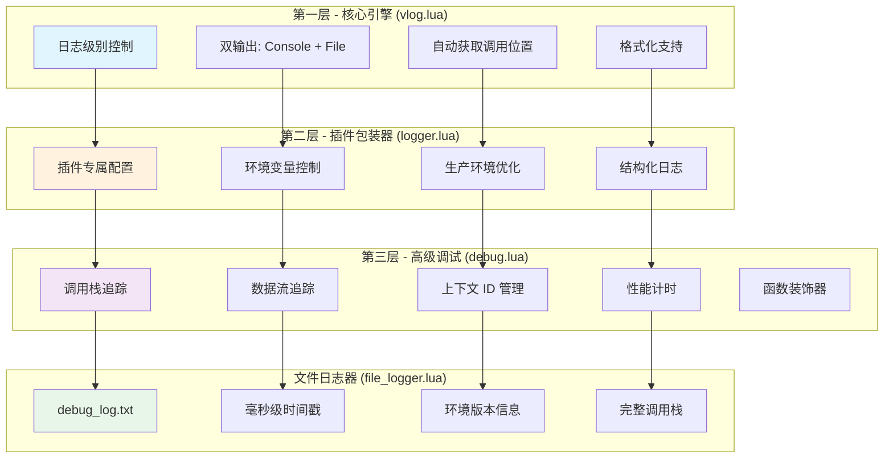

### 日志级别定义

| 级别 | 标识 | 用途 | 高亮 |
|-----|------|------|------|
| trace | `[TRACE]` | 最详细的追踪信息 | Comment |
| debug | `[DEBUG]` | 调试信息、调用栈 | Comment |
| info | `[INFO]` | 正常操作信息 | Directory |
| warn | `[WARN]` | 警告信息 | WarningMsg |
| error | `[ERROR]` | 错误信息 | ErrorMsg |
| fatal | `[FATAL]` | 致命错误 | ErrorMsg |

### 日志格式规范

#### 基础格式

```
[YYYY-MM-DD HH:MM:SS.mmm] [级别] [上下文ID] 调用栈: 操作描述 | 数据流信息
```

#### 示例日志输出

```
[2024-12-27 14:23:45.123] [START] ========== 任务开始 ==========
[2024-12-27 14:23:45.124] [INFO] 环境: dev | 版本: v0.1.0 | Neovim: 0.10.0
[2024-12-27 14:23:45.125] [INFO] 配置: session=worktrees, sync=true
[2024-12-27 14:23:45.234] [INFO] [wt_20241227_142345] core.create() → git.create_worktree() line 45: 创建 worktree
[2024-12-27 14:23:45.345] [DEBUG] [wt_20241227_142345] 数据流: 输入 branch=feature/auth → 验证中
[2024-12-27 14:23:45.456] [DEBUG] [wt_20241227_142345] 调用栈: create_worktree_window() → git.create_worktree() → async.git()
[2024-12-27 14:23:45.567] [INFO] [wt_20241227_142345] git worktree 创建成功 | 路径: ~/worktrees/myrepo-feature-auth
[2024-12-27 14:23:45.678] [INFO] [wt_20241227_142345] core.create() → tmux.create_window() line 67: 创建 tmux window
[2024-12-27 14:23:45.789] [DEBUG] [wt_20241227_142345] 数据流: window_name=wt-myrepo-feature-auth → 创建中
[2024-12-27 14:23:45.890] [INFO] [wt_20241227_142345] tmux window 创建成功
[2024-12-27 14:23:46.001] [END] [wt_20241227_142345] ========== 任务完成 | 总耗时: 878ms ==========
```

### 模块设计

#### 1. 核心日志引擎 (`log/vlog.lua`)

**职责**：基础日志功能（基于 tjdevries/vlog.nvim）

```lua
local M = {}

local default_config = {
    plugin = 'worktree-tmux.nvim',
    use_console = true,
    use_file = true,
    highlights = true,
    level = "info",
    modes = {
        { name = "trace", hl = "Comment" },
        { name = "debug", hl = "Comment" },
        { name = "info", hl = "Directory" },
        { name = "warn", hl = "WarningMsg" },
        { name = "error", hl = "ErrorMsg" },
        { name = "fatal", hl = "ErrorMsg" },
    },
    float_precision = 0.01,
}

--- 创建新的日志实例
---@param config table 日志配置
---@return table 日志实例
M.new = function(config)
    config = vim.tbl_deep_extend("force", default_config, config or {})

    -- 日志文件路径: ~/.local/share/nvim/worktree-tmux.nvim.log
    local outfile = string.format('%s/%s.log',
        vim.fn.stdpath('data'), config.plugin)

    local obj = {}
    local levels = {}

    for i, v in ipairs(config.modes) do
        levels[v.name] = i
    end

    local log_at_level = function(level, level_config, ...)
        if level < levels[config.level] then return end

        local nameupper = level_config.name:upper()
        local msg = table.concat(vim.tbl_map(tostring, {...}), " ")

        -- 获取调用位置
        local info = debug.getinfo(3, "Sl")
        local lineinfo = info.short_src .. ":" .. info.currentline

        -- 输出到控制台
        if config.use_console then
            local console_str = string.format("[%-6s%s] %s: %s",
                nameupper, os.date("%H:%M:%S"), lineinfo, msg)

            if config.highlights and level_config.hl then
                vim.cmd(string.format("echohl %s", level_config.hl))
            end
            vim.cmd(string.format([[echom "[%s] %s"]], config.plugin, vim.fn.escape(console_str, '"')))
            if config.highlights then
                vim.cmd("echohl NONE")
            end
        end

        -- 输出到文件
        if config.use_file then
            local fp = io.open(outfile, "a")
            if fp then
                local str = string.format("[%-6s%s] %s: %s\n",
                    nameupper, os.date(), lineinfo, msg)
                fp:write(str)
                fp:close()
            end
        end
    end

    -- 创建各级别方法
    for i, x in ipairs(config.modes) do
        obj[x.name] = function(...)
            return log_at_level(i, x, ...)
        end
    end

    return obj
end

return M
```

#### 2. 插件包装器 (`log/logger.lua`)

**职责**：插件专属配置、环境变量控制

```lua
local vlog = require('worktree-tmux.log.vlog')

-- 创建插件专用日志实例
local log = vlog.new({
    plugin = 'worktree-tmux.nvim',
    use_console = true,
    use_file = true,
    highlights = true,
    level = vim.env.WORKTREE_LOG_LEVEL or "info",
})

-- 生产环境优化：禁用 trace/debug
local is_debug = vim.env.WORKTREE_ENV ~= "production"
local original_trace = log.trace
local original_debug = log.debug

log.trace = function(...)
    if is_debug then original_trace(...) end
end

log.debug = function(...)
    if is_debug then original_debug(...) end
end

-- 结构化日志
function log.structured(level, event, data)
    local msg = string.format("[%s] %s", event, vim.inspect(data))
    log[level](msg)
end

return log
```

#### 3. 高级调试工具 (`log/debug.lua`)

**职责**：调用栈追踪、数据流追踪、上下文管理

```lua
local log = require('worktree-tmux.log.logger')

local M = {}

-- 调试上下文管理
local debug_contexts = {}
local current_context = nil
local request_id_counter = 0

--- 生成请求 ID
---@return string
local function generate_request_id()
    request_id_counter = request_id_counter + 1
    return string.format("wt_%s_%d",
        os.date("%Y%m%d_%H%M%S"),
        request_id_counter)
end

--- 获取调用栈信息
---@param depth number 调用深度
---@return string
local function get_call_stack(depth)
    local stack = {}
    for i = depth, depth + 5 do
        local info = debug.getinfo(i, "nSl")
        if not info then break end
        local name = info.name or "anonymous"
        local line = info.currentline or 0
        table.insert(stack, string.format("%s() line %d", name, line))
    end
    return table.concat(stack, " → ")
end

--- 获取毫秒级时间戳
---@return string
local function get_timestamp()
    local time = vim.loop.hrtime() / 1e6
    local ms = math.floor(time % 1000)
    return os.date("%Y-%m-%d %H:%M:%S") .. string.format(".%03d", ms)
end

--- 开始调试上下文
---@param context string 上下文名称
---@return string request_id
function M.begin(context)
    local request_id = generate_request_id()
    current_context = context
    debug_contexts[context] = {
        request_id = request_id,
        start_time = vim.loop.hrtime(),
        logs = {},
        data_flow = {},
    }

    M.log_raw("[START]", string.format("========== %s 开始 ==========", context))

    -- 记录环境信息
    M.log_raw("[INFO]", string.format("环境: %s | 版本: %s | Neovim: %s",
        vim.env.WORKTREE_ENV or "dev",
        "v0.1.0",
        vim.version().major .. "." .. vim.version().minor .. "." .. vim.version().patch))

    return request_id
end

--- 结束调试上下文
function M.done()
    if not current_context then
        log.warn("No active debug context")
        return
    end

    local ctx = debug_contexts[current_context]
    if ctx then
        local duration = (vim.loop.hrtime() - ctx.start_time) / 1e6
        M.log_raw("[END]", string.format("========== %s 完成 | 总耗时: %.0fms ==========",
            current_context, duration))
    end

    current_context = nil
end

--- 原始日志记录（带完整格式）
---@param level string 日志级别
---@param msg string 消息
function M.log_raw(level, msg)
    local ctx = current_context and debug_contexts[current_context]
    local request_id = ctx and ctx.request_id or ""
    local id_part = request_id ~= "" and string.format("[%s] ", request_id) or ""

    local formatted = string.format("[%s] %s %s%s",
        get_timestamp(), level, id_part, msg)

    -- 输出到控制台和文件
    log.info(formatted)
end

--- 记录调用栈
---@param fn_name string 函数名
---@param ... any 参数
function M.fn_call(fn_name, ...)
    local args = {...}
    local args_str = vim.tbl_map(function(a)
        return type(a) == "table" and vim.inspect(a) or tostring(a)
    end, args)

    local call_stack = get_call_stack(3)
    M.log_raw("[DEBUG]", string.format("调用栈: %s | 参数: %s",
        call_stack, table.concat(args_str, ", ")))
end

--- 记录函数返回
---@param fn_name string 函数名
---@param ... any 返回值
function M.fn_return(fn_name, ...)
    local returns = {...}
    local ret_str = vim.tbl_map(function(r)
        return type(r) == "table" and vim.inspect(r) or tostring(r)
    end, returns)

    M.log_raw("[DEBUG]", string.format("返回: %s() → %s",
        fn_name, table.concat(ret_str, ", ")))
end

--- 记录数据流
---@param input any 输入数据
---@param output any 输出数据
---@param operation string 操作描述
function M.data_flow(input, output, operation)
    local input_str = type(input) == "table"
        and string.format("%d 条记录", #input)
        or tostring(input)
    local output_str = type(output) == "table"
        and string.format("%d 条记录", #output)
        or tostring(output)

    M.log_raw("[DEBUG]", string.format("数据流: 输入 %s → %s → 输出 %s",
        input_str, operation, output_str))
end

--- 检查点
---@param name string 检查点名称
---@param data? table 额外数据
function M.checkpoint(name, data)
    local data_str = data and string.format(" | 数据: %s", vim.inspect(data)) or ""
    M.log_raw("[INFO]", string.format("✓ 检查点: %s%s", name, data_str))
end

--- 函数装饰器：自动记录调用和返回
---@param fn function 要装饰的函数
---@param name string 函数名称
---@return function
function M.wrap(fn, name)
    return function(...)
        M.fn_call(name, ...)
        local start = vim.loop.hrtime()
        local results = {fn(...)}
        local duration = (vim.loop.hrtime() - start) / 1e6
        M.fn_return(name, unpack(results))
        M.log_raw("[DEBUG]", string.format("%s() 耗时: %.2fms", name, duration))
        return unpack(results)
    end
end

--- 带作用域的调试
---@param context string 上下文名称
---@param fn function 要执行的函数
---@return any
function M.scope(context, fn)
    M.begin(context)
    local ok, result = pcall(fn)
    M.done()

    if not ok then
        M.log_raw("[ERROR]", string.format("作用域 '%s' 出错: %s", context, result))
        error(result)
    end

    return result
end

--- 获取调试报告
---@param context? string 上下文名称
---@return table
function M.report(context)
    if context then
        return debug_contexts[context]
    end
    return debug_contexts
end

--- 清空调试上下文
function M.clear()
    debug_contexts = {}
    current_context = nil
    request_id_counter = 0
end

-- 导出快捷方法
M.trace = function(msg, data) log.trace(data and string.format("%s: %s", msg, vim.inspect(data)) or msg) end
M.debug = function(msg, data) log.debug(data and string.format("%s: %s", msg, vim.inspect(data)) or msg) end
M.info = function(msg, data) log.info(data and string.format("%s: %s", msg, vim.inspect(data)) or msg) end
M.warn = function(msg, data) log.warn(data and string.format("%s: %s", msg, vim.inspect(data)) or msg) end
M.error = function(msg, data) log.error(data and string.format("%s: %s", msg, vim.inspect(data)) or msg) end

return M
```

#### 4. 文件日志器 (`log/file_logger.lua`)

**职责**：生成 `debug_log.txt` 文件，完全符合调试日志规范

```lua
local M = {}

local log_file_path = nil
local log_file = nil

--- 初始化日志文件
---@param path? string 日志文件路径，默认为工作目录下的 debug_log.txt
function M.init(path)
    log_file_path = path or (vim.fn.getcwd() .. "/debug_log.txt")

    -- 删除旧文件，创建新文件
    os.remove(log_file_path)

    log_file = io.open(log_file_path, "w")
    if log_file then
        log_file:setvbuf("line")  -- 行缓冲，实时写入
    end
end

--- 获取毫秒级时间戳
---@return string
local function get_timestamp()
    local time = vim.loop.hrtime() / 1e6
    local ms = math.floor(time % 1000)
    return os.date("%Y-%m-%d %H:%M:%S") .. string.format(".%03d", ms)
end

--- 写入日志
---@param level string 日志级别
---@param request_id string 请求 ID
---@param message string 消息
function M.write(level, request_id, message)
    if not log_file then return end

    local id_part = request_id and request_id ~= ""
        and string.format("[%s] ", request_id)
        or ""

    local line = string.format("[%s] [%s] %s%s\n",
        get_timestamp(), level, id_part, message)

    log_file:write(line)
end

--- 写入环境信息（任务开始时调用）
function M.write_env_info()
    M.write("INFO", nil, string.format(
        "环境: %s | 版本: %s | Neovim: %s | Lua: %s",
        vim.env.WORKTREE_ENV or "dev",
        "v0.1.0",
        vim.version().major .. "." .. vim.version().minor .. "." .. vim.version().patch,
        _VERSION
    ))

    local config = require("worktree-tmux.config")
    M.write("INFO", nil, string.format(
        "配置: session=%s, sync=%s, async=%s",
        config.options.session_name or "worktrees",
        tostring(config.options.sync_ignored_files),
        tostring(config.options.async and config.options.async.show_progress)
    ))
end

--- 写入调用栈
---@param request_id string
---@param depth number
function M.write_call_stack(request_id, depth)
    local stack = {}
    for i = depth, depth + 10 do
        local info = debug.getinfo(i, "nSl")
        if not info then break end
        local name = info.name or "anonymous"
        local src = info.short_src or "unknown"
        local line = info.currentline or 0
        table.insert(stack, string.format("  %s() at %s:%d", name, src, line))
    end

    if #stack > 0 then
        M.write("DEBUG", request_id, "调用栈:")
        for _, s in ipairs(stack) do
            M.write("DEBUG", request_id, s)
        end
    end
end

--- 关闭日志文件
function M.close()
    if log_file then
        log_file:close()
        log_file = nil
    end
end

--- 获取日志文件路径
---@return string|nil
function M.get_path()
    return log_file_path
end

return M
```

### 使用示例

#### 基础日志

```lua
local log = require('worktree-tmux.log.logger')

log.info("创建 worktree", { branch = "feature/auth" })
log.debug("验证参数完成")
log.warn("目录已存在，将被覆盖")
log.error("git 命令执行失败", { code = 128 })
```

#### 调试追踪

```lua
local dbg = require('worktree-tmux.log.debug')

-- 开始调试上下文
dbg.begin("create_worktree_window")

-- 记录调用栈
dbg.fn_call("git.create_worktree", "feature/auth", "main")

-- 记录数据流
dbg.data_flow("feature/auth", "/home/user/worktrees/repo-feature-auth", "路径生成")

-- 检查点
dbg.checkpoint("worktree_created", { path = "/home/user/worktrees/..." })

-- 结束上下文
dbg.done()
```

#### 函数装饰器

```lua
local dbg = require('worktree-tmux.log.debug')

-- 自动追踪函数调用
local create_worktree = dbg.wrap(function(branch, base)
    -- 实现...
    return true, "/path/to/worktree"
end, "create_worktree")

-- 调用时会自动记录输入参数、返回值、耗时
create_worktree("feature/auth", "main")
```

#### 文件日志

```lua
local file_logger = require('worktree-tmux.log.file_logger')

-- 初始化（会删除旧文件）
file_logger.init()

-- 写入环境信息
file_logger.write_env_info()

-- 写入日志
file_logger.write("INFO", "wt_123", "开始创建 worktree")

-- 写入调用栈
file_logger.write_call_stack("wt_123", 2)

-- 关闭
file_logger.close()
```

### 日志配置

```lua
require("worktree-tmux").setup({
    -- ... 其他配置

    log = {
        -- 日志级别: trace, debug, info, warn, error, fatal
        level = "info",

        -- 输出目标
        use_console = true,      -- Neovim 控制台
        use_file = true,         -- ~/.local/share/nvim/worktree-tmux.nvim.log

        -- 调试模式
        debug_mode = false,      -- 启用后生成 debug_log.txt
        debug_file = nil,        -- 自定义 debug_log.txt 路径

        -- 高亮
        highlights = true,
    },
})
```

### 环境变量控制

```bash
# 设置日志级别
WORKTREE_LOG_LEVEL=debug nvim

# 设置为生产环境（禁用 trace/debug）
WORKTREE_ENV=production nvim
```

---

## 🔄 核心算法

### 算法 1: 创建 Worktree + Window

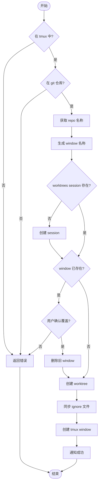

**伪代码**：

```lua
function create_worktree_window(branch_name, base_branch)
    -- 1. 前置检查
    if not tmux.in_tmux() then
        return error("必须在 tmux 中使用")
    end

    local repo_name = git.get_repo_name()
    if not repo_name then
        return error("不在 git 仓库中")
    end

    -- 2. 准备变量
    local session_name = config.get("session_name")
    local window_name = format_window_name(repo_name, branch_name)
    local worktree_path = resolve_worktree_path(branch_name)

    -- 3. 确保 session 存在
    if not tmux.session_exists(session_name) then
        if not tmux.create_session(session_name) then
            return error("创建 session 失败")
        end
    end

    -- 4. 处理 window 重名
    if tmux.window_exists(session_name, window_name) then
        if not ui.confirm_overwrite(window_name) then
            return false
        end
        tmux.delete_window(session_name, window_name)
    end

    -- 5. 创建 git worktree
    if not git.create_worktree(worktree_path, branch_name, base_branch) then
        return error("创建 worktree 失败")
    end

    -- 6. 同步 ignore 文件
    if config.get("sync_ignored_files") then
        local source = git.get_repo_root()
        sync.sync_ignored_files(source, worktree_path)
    end

    -- 7. 创建 tmux window
    local success = tmux.create_window({
        session = session_name,
        name = window_name,
        cwd = worktree_path,
        cmd = config.get("window_command"),
    })

    if not success then
        -- 回滚：删除刚创建的 worktree
        git.delete_worktree(worktree_path)
        return error("创建 tmux window 失败")
    end

    -- 8. 通知用户
    vim.notify(
        string.format("✅ 创建成功: %s", window_name),
        vim.log.levels.INFO
    )

    return true
end
```

---

### 算法 2: Window 命名规则

```mermaid
graph LR
    A[分支名] --> B{包含 /}
    B -->|是| C[feature/user-auth]
    B -->|否| D[hotfix-bug]
    C --> E[保留完整名]
    D --> E
    E --> F[格式化]
    F --> G[wt-{repo}-{branch}]
    G --> H[wt-myproject-feature-user-auth]
```

**实现**：

```lua
--- 格式化 window 名称
-- @param repo_name string
-- @param branch_name string
-- @return string
local function format_window_name(repo_name, branch_name)
    -- 保留完整分支名（包括 /）
    -- 但 tmux window 名不能有某些特殊字符，需要转义
    local safe_branch = branch_name:gsub("/", "-")

    return string.format("wt-%s-%s", repo_name, safe_branch)
end

-- 示例：
-- format_window_name("myproject", "feature/user-auth")
-- 返回："wt-myproject-feature-user-auth"
```

---

### 算法 3: 同步 Ignored 文件

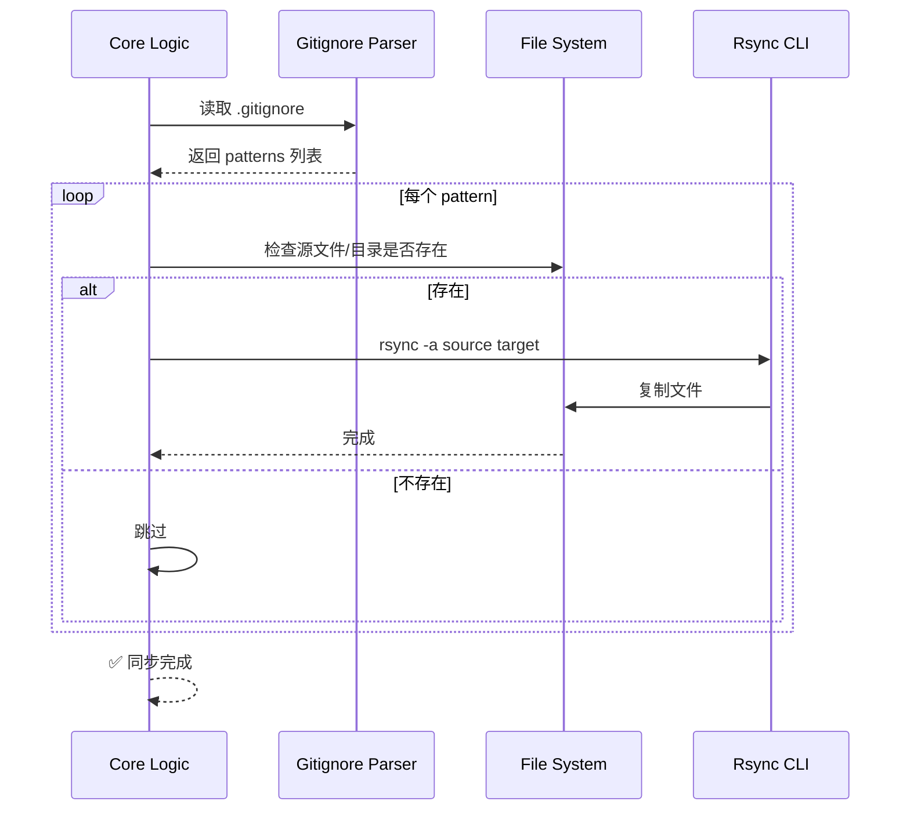

**关键点**：

- 使用 `rsync -a` 保持权限和时间戳
- 排除 `.git` 目录避免冲突
- 处理嵌套目录（如 `node_modules/pkg/node_modules`）

---

## ⚙️ 配置规格

### 配置结构

```lua
-- ~/.config/nvim/lua/plugins/worktree-tmux.lua
return {
  "yourusername/worktree-tmux.nvim",
  dependencies = {
    -- 必选依赖
    "nvim-lua/plenary.nvim",  -- 异步执行、路径处理
    "MunifTanjim/nui.nvim",   -- UI 组件（输入框、确认对话框）

    -- 可选依赖
    "ibhagwan/fzf-lua",       -- Worktree 跳转选择器
    "folke/snacks.nvim",      -- 通知系统（可选，fallback 到 vim.notify）
  },
  config = function()
    require("worktree-tmux").setup({
      -- Tmux session 名称（固定）
      session_name = "worktrees",

      -- Worktree 基础目录
      -- 支持：绝对路径、相对路径、函数
      worktree_base_dir = "~/worktrees",
      -- 或：worktree_base_dir = "../worktrees",
      -- 或：worktree_base_dir = function()
      --       return vim.fn.expand("~/custom/path")
      --     end,

      -- Window 启动命令
      -- nil = 空 shell
      -- "nvim" = 自动启动 nvim
      -- "nvim -c 'ClaudeCode'" = 启动 nvim + Claude
      window_command = nil,

      -- Window 命名模板
      -- 占位符：{repo}, {branch}, {base}
      window_name_template = "wt-{repo}-{branch}",

      -- 是否同步 ignore 文件
      sync_ignored_files = true,

      -- 重名 window 处理
      -- "ask" = 询问用户（使用 nui.nvim 确认对话框）
      -- "overwrite" = 直接覆盖
      -- "skip" = 跳过不创建
      on_duplicate_window = "ask",

      -- UI 配置
      ui = {
        -- 输入框配置 (nui.nvim)
        input = {
          border = "rounded",
          width = 60,
          position = "50%",
        },
        -- 确认对话框配置 (nui.nvim)
        confirm = {
          border = "rounded",
          width = 40,
        },
      },

      -- fzf-lua 配置
      fzf_opts = {
        prompt = "Worktree Jump> ",
        winopts = {
          height = 0.4,
          width = 0.6,
        },
      },

      -- 通知配置
      notify = {
        -- 使用 snacks.nvim（如果可用）
        use_snacks = true,
        -- 通知显示时间（毫秒）
        timeout = 3000,
      },

      -- 异步执行配置
      async = {
        -- 是否显示进度通知
        show_progress = true,
        -- rsync 超时时间（秒）
        rsync_timeout = 60,
      },
    })
  end,
  keys = {
    { "<leader>wc", "<cmd>WorktreeCreate<cr>", desc = "创建 Worktree" },
    { "<leader>wj", "<cmd>WorktreeJump<cr>", desc = "跳转 Worktree" },
    { "<leader>wd", "<cmd>WorktreeDelete<cr>", desc = "删除 Worktree" },
    { "<leader>ws", "<cmd>WorktreeSync<cr>", desc = "同步 Worktrees" },
    { "<leader>wl", "<cmd>WorktreeList<cr>", desc = "列出 Worktrees" },
  },
}
```

### 配置验证

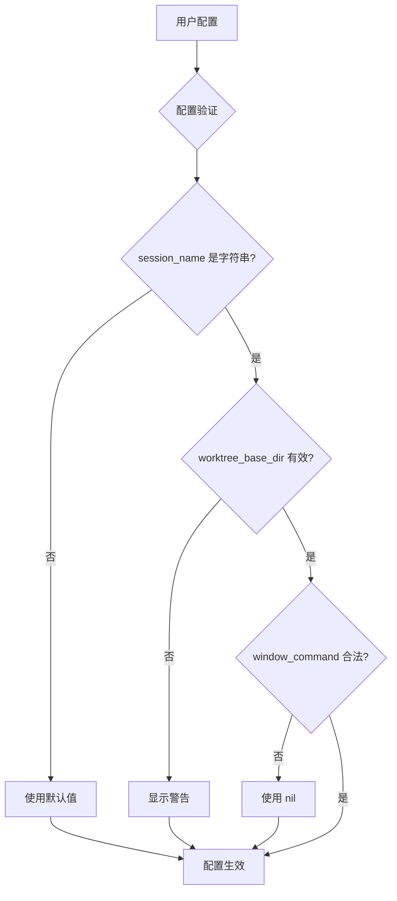

---

## 🧪 测试计划

### 单元测试

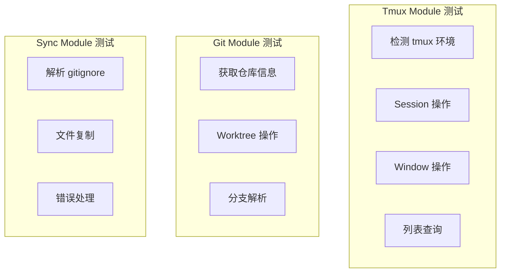

#### 测试用例示例

```lua
describe("tmux module", function()
    describe("in_tmux()", function()
        it("应该在 tmux 中返回 true", function()
            vim.env.TMUX = "/tmp/tmux-1000/default,12345,0"
            assert.is_true(require("worktree-tmux.tmux").in_tmux())
        end)

        it("应该在非 tmux 中返回 false", function()
            vim.env.TMUX = nil
            assert.is_false(require("worktree-tmux.tmux").in_tmux())
        end)
    end)

    describe("session_exists()", function()
        it("应该正确检测 session", function()
            -- 需要 mock vim.fn.system
            local tmux = require("worktree-tmux.tmux")
            -- 测试实现...
        end)
    end)
end)
```

### 集成测试

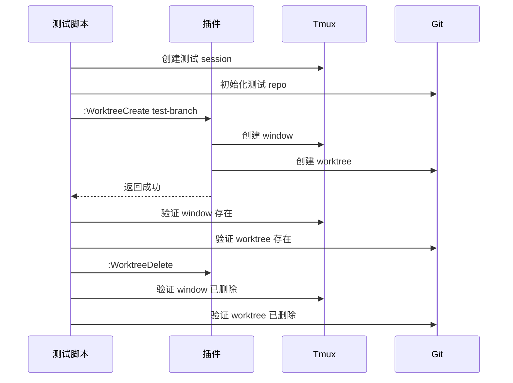

### 手动测试清单

- [ ] 在 tmux 外执行命令显示错误
- [ ] 在非 git 仓库执行命令显示错误
- [ ] 创建 worktree 成功
- [ ] Window 名称正确
- [ ] 同步 ignore 文件成功（检查 node_modules 等）
- [ ] 重名 window 询问正确
- [ ] fzf-lua 跳转正确
- [ ] 删除 worktree 自动删除 window
- [ ] 同步命令修复缺失 window

---

## 📅 开发步骤

### 阶段 1：基础框架（第 1-2 天）


**任务清单**：

- [ ] 创建项目目录结构
- [ ] 设置插件入口文件
- [ ] 实现 config.lua 模块
- [ ] 编写基础文档

### 阶段 2：核心功能（第 3-5 天）

**任务清单**：

- [ ] 实现 tmux.lua 模块
- [ ] 实现 git.lua 模块
- [ ] 实现 sync.lua 模块
- [ ] 实现 core.lua 创建逻辑
- [ ] 编写单元测试

### 阶段 3：UI 集成（第 6-7 天）

**任务清单**：

- [ ] 实现 ui.lua 模块
- [ ] 集成 fzf-lua
- [ ] 实现跳转功能
- [ ] 优化用户体验

### 阶段 4：完善功能（第 8-9 天）

**任务清单**：

- [ ] 实现删除功能
- [ ] 实现同步功能
- [ ] 边界情况处理
- [ ] 错误处理优化

### 阶段 5：测试与文档（第 10 天）

**任务清单**：

- [ ] 集成测试
- [ ] 性能优化
- [ ] 完善文档
- [ ] 录制演示视频

---

## ⚠️ 风险与挑战

### 技术风险

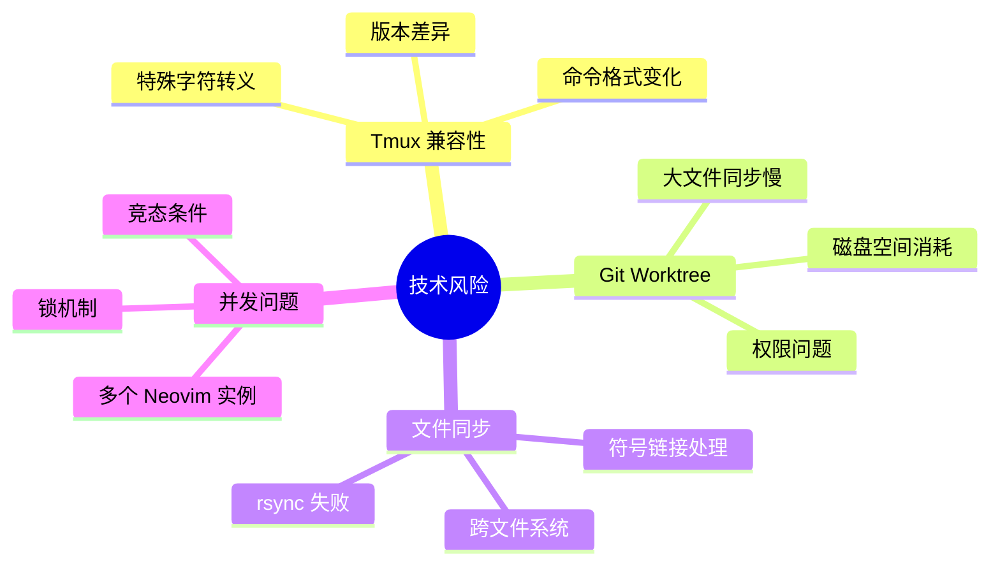

### 解决方案

| 风险            | 影响 | 缓解措施                 |
| --------------- | ---- | ------------------------ |
| Tmux 版本兼容性 | 高   | 检测版本，使用兼容命令   |
| 磁盘空间不足    | 中   | 创建前检查空间           |
| rsync 失败      | 中   | 添加重试机制，详细日志   |
| 并发冲突        | 低   | tmux 本身全局，无需锁    |
| 特殊字符处理    | 中   | 规范化命名，转义特殊字符 |

---

## 📚 参考资料

### 核心依赖

- [plenary.nvim](https://github.com/nvim-lua/plenary.nvim) - 异步执行、路径处理、测试框架
- [nui.nvim](https://github.com/MunifTanjim/nui.nvim) - UI 组件库（输入框、菜单、弹窗）
- [fzf-lua](https://github.com/ibhagwan/fzf-lua) - 模糊搜索选择器
- [snacks.nvim](https://github.com/folke/snacks.nvim) - 通知系统和小工具集

### 外部工具

- [Git Worktree 官方文档](https://git-scm.com/docs/git-worktree)
- [Tmux Manual](https://man7.org/linux/man-pages/man1/tmux.1.html)

### Neovim 开发

- [Neovim Lua API](https://neovim.io/doc/user/lua.html)
- [plenary.job 文档](https://github.com/nvim-lua/plenary.nvim#plenaryjob)
- [nui.nvim 组件文档](https://github.com/MunifTanjim/nui.nvim/tree/main/lua/nui)

---

## 📊 项目统计

```mermaid
pie title 代码模块占比估计
    "Core Logic" : 20
    "Async (plenary.job)" : 15
    "Tmux Wrapper" : 15
    "Git Wrapper" : 12
    "UI - nui.nvim" : 18
    "UI - fzf-lua" : 8
    "Notify (snacks)" : 7
    "Config & Utils" : 5
```

**预估代码量**：

- 核心逻辑：~300 行
- 异步执行 (plenary.job)：~150 行
- Tmux 封装：~200 行
- Git 封装：~150 行
- UI 输入/确认 (nui.nvim)：~250 行
- UI 选择器 (fzf-lua)：~100 行
- 通知封装 (snacks.nvim)：~100 行
- 配置工具：~100 行
- **总计**：~1350 行 Lua 代码

---

## ✅ 验收标准

### 功能验收

- [ ] 创建 worktree 成功创建对应 tmux window
- [ ] Window 命名符合 `wt-{repo}-{branch}` 格式
- [ ] 所有文件同步成功（包括 .gitignore 内容）
- [ ] fzf-lua 可以模糊搜索并跳转
- [ ] 删除 worktree 自动删除 window
- [ ] 同步功能修复缺失 window
- [ ] 错误处理正确（不在 tmux、不在 git repo 等）

### 性能验收

- [ ] 创建操作 < 5 秒（正常网络）
- [ ] 跳转操作 < 1 秒
- [ ] fzf 搜索响应 < 0.5 秒

### 代码质量

- [ ] 单元测试覆盖率 > 80%
- [ ] 无 Lua LSP 警告
- [ ] 符合 stylua 格式规范
- [ ] 文档完整（README + API 文档）

---

## 🎉 总结

本开发计划详细定义了 Git Worktrees + Tmux Windows 自动化管理系统的需求、设计、实现和测试方案。

**核心创新点**：

1. 自动化 worktree 和 tmux 环境的联动
2. 完整的文件同步（包括 ignore 内容）
3. fzf-lua 快速导航
4. 可配置的灵活架构

**下一步行动**：

1. ✅ 开发计划已完成
2. ⏭️ 开始阶段 1：基础框架搭建
3. 📝 更新进度追踪文档

---

**文档版本**：v1.2
**最后更新**：2025-12-27
**作者**：Pittcat
**审核状态**：待审核

---

## 📝 更新日志

### v1.2 (2025-12-27)

**采用 base.nvim 模版**：
- ✅ 重构目录结构，采用 base.nvim 标准模版
- ✅ 添加 `plugin/` 入口层（延迟加载）
- ✅ 添加 `spec/` 测试层 (busted + nlua)
- ✅ 添加 `docs/` Markdown 文档目录
- ✅ 添加 LuaCATS 类型定义 (`types.lua`)
- ✅ 添加健康检查模块 (`health.lua`)

**完整日志调试系统**：
- ✅ 三层日志架构：vlog.lua → logger.lua → debug.lua
- ✅ 文件日志器 (`file_logger.lua`) 生成 `debug_log.txt`
- ✅ 调用栈追踪、数据流追踪、上下文 ID 管理
- ✅ 毫秒级时间戳、环境版本信息
- ✅ 函数装饰器自动追踪
- ✅ 环境变量控制 (`WORKTREE_LOG_LEVEL`, `WORKTREE_ENV`)

**日志格式规范**：
- ✅ 格式：`[YYYY-MM-DD HH:MM:SS.mmm] [级别] [上下文ID] 消息`
- ✅ 6 个日志级别：trace, debug, info, warn, error, fatal
- ✅ 支持生产环境优化（禁用 trace/debug）

### v1.1 (2025-12-27)

**新增依赖**：
- ✅ `plenary.nvim` - 异步执行 git/rsync 命令
- ✅ `nui.nvim` - 自定义输入框和确认对话框
- ✅ `snacks.nvim` - 通知系统（可选）

**架构调整**：
- ✅ 添加异步执行层 (plenary.job)
- ✅ UI 模块拆分为 input/confirm/picker/progress
- ✅ 通知系统封装 (snacks.nvim fallback 到 vim.notify)

**配置更新**：
- ✅ 新增 `ui` 配置块（输入框、确认对话框样式）
- ✅ 新增 `notify` 配置块
- ✅ 新增 `async` 配置块（进度通知、超时设置）
